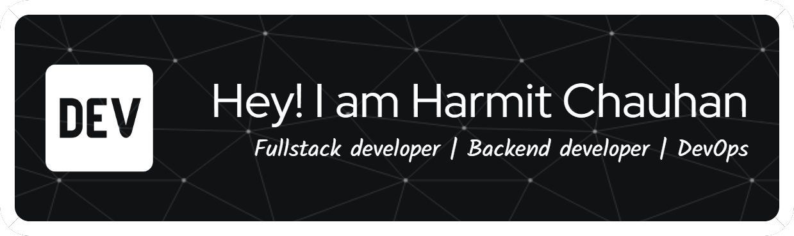

### About Me

- 🌱 An active learner who enjoys exploring new technologies and working on projects.
- ☕ Passionate about Java, I solve LeetCode problems using Java and have experience with Java frameworks such as Spring Boot, Spring Data JPA, and Hibernate.
- 💻 Dived into the MERN stack last year, finding it fascinating to develop full-stack projects.
- 🧠 Understanding of Object-Oriented Programming, Agile methodology, Data Structures, and Algorithms (still learning more!).
- 🚀 Enthusiastic about DevOps (I Love discussing and learning about DevOps, my favorite topic for the past two years. I have practical experience with tools like Jenkins, Azure DevOps, and Docker.)
- 🎮 Enjoy playing FPS games like Valorant and CS2 (now Counter-Strike 2).
- 📺 A sports enthusiast who follows football, Formula 1, and basketball.
- 📚 Also a reader and writer.

    
    
    

## :link: Connect with me

  
   
  

<!--
**harmit17/harmit17** is a ✨ _special_ ✨ repository because its `README.md` (this file) appears on your GitHub profile.

Here are some ideas to get you started:

- 🔭 I’m currently working on ...
- 🌱 I’m currently learning ...
- 👯 I’m looking to collaborate on ...
- 🤔 I’m looking for help with ...
- 💬 Ask me about ...
- 📫 How to reach me: ...
- 😄 Pronouns: ...
- ⚡ Fun fact: ...
-->
